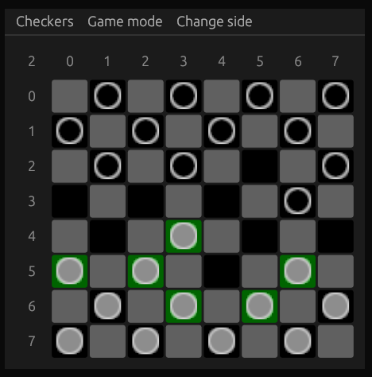

# Checkers


# how to run
```bash
cargo run
```

# todo
- [X] highlight pieces, which can be sellected to move
- [X] player will play againts min max algorithm
- [X] add ability to change side (black/white)
- [X] menu buttons: restart game, select algorith to play againts
- [X] show text on win/lose/draw with restart and exit buttons
- [X] make checkers looks like checkers (add images instead of w/b/W/B)
- [X] highlight avalable checkers when user pres white cell or unmoveable checker
- [X] optimize minmax algorth (now it plays with acceptable speed when depth <= 5)
- [X] optimize minmax algorth (now it plays with acceptable speed when depth <= 10)
  - [X] alpha-beta [[https://www.youtube.com/watch?v=l-hh51ncgDI]]
- [X] fix algorighm, now it is extrimily stupid, can't win me on depth=20
- [X] highlight previous moves, for multijump moves highlight all previous positions

# info
- i play one game with myself and there was 4.773333333333333 avalable moves per turn in general